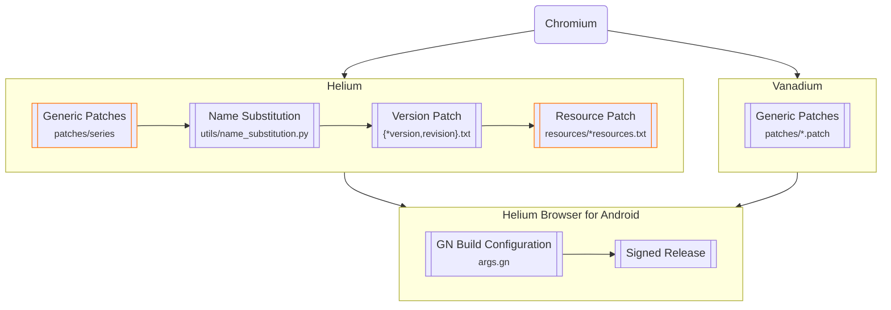

# Helium Browser for Android

An experimental Chromium-based web browser for Android with extensions support, based on
- [Helium](https://github.com/imputnet/helium) by [imput](https://github.com/imputnet), as well as 
- [Vanadium](https://github.com/GrapheneOS/Vanadium) by [GrapheneOS](https://github.com/GrapheneOS)

## Usage

### Installing Extensions

Navigate to [Chrome Web Store](https://chromewebstore.google.com/), then enable **Desktop site** by selecting the menu button <kbd>⋮</kbd> in the top right corner and ensure the option is checked. Select **Okay** and proceed as normal if prompted with:
> The Chrome Web Store is only available on desktop.
 
Once you select **Add to Chrome**, [the extension will be installed in the background](https://support.google.com/chrome_webstore/answer/2664769) until the button changes into **Remove from Chrome**.

### Debug URLs

To view and access the debug URLs, use [`chrome://chrome-urls`](chrome://chrome-urls). For **Experiments**, use [`chrome://flags`](chrome://flags).

### WebRTC IP Policy

Consistent with both Helium and Vanadium, the option is available by selecting the menu button <kbd>⋮</kbd> in the top right corner, then **Settings**, **Privacy and security**, then under **Privacy**, **WebRTC IP handling policy**. If you experience issues with WebRTC due to the IPs being shielded by default (e.g. [Discord Voice](https://discord.com/blog/how-discord-handles-two-and-half-million-concurrent-voice-users-using-webrtc)), you may try to change it to **Default public interface only**, or **Default**.

## Implementation

> [!WARNING]
> All builds are experimental, so unexpected issues may occur. [Helium Browser for Android](#helium-browser-for-android) only attempts to improve security and privacy where possible. For better protection on Android, you should instead use [GrapheneOS](https://grapheneos.org) with [Vanadium](https://vanadium.app), which additionally integrates patches into Android System WebView and provides significant kernel and memory management hardening on the OS level.

The full build aims to be consistent with [Helium](https://github.com/imputnet/helium-linux), which means additional patches are necessary before all features can be ported over. All [Vanadium](https://github.com/GrapheneOS/Vanadium) patches are applied by default. Further patches are underway.

## Building

This repository provides the build script to compile on the latest Ubuntu, and may also work with other Linux distributions.

To build these releases yourself via CI (e.g. GitHub Actions), fork this repository. Supply your `base64` encoded `keystore.jks` and `local.properties` (containing your `keyAlias`, `keyPassword` and `storePassword`) to [**Repository secrets**](https://github.com/jqssun/android-helium-browser/blob/main/.github/workflows/build.yml#L28-L29) under **Settings** > **Secrets and variables** > **Actions**. To generate a release, go to **Actions**, select **Build**, and select **Run workflow**. Under **Runner**, you can either use a GitHub-hosted runner by entering `ubuntu-latest`, or `self-hosted` for your own hardware.

## Credits

This project would not have been possible without the huge community contributions from [Helium](https://github.com/imputnet/helium), [Vanadium](https://github.com/GrapheneOS/Vanadium), as well as [ungoogled-chromium](https://github.com/ungoogled-software/ungoogled-chromium) and various other upstream projects. 

All credit goes to the original authors and contributors. This project is named to reflect support for [Helium's](https://helium.computer) naming in a recent controversy.